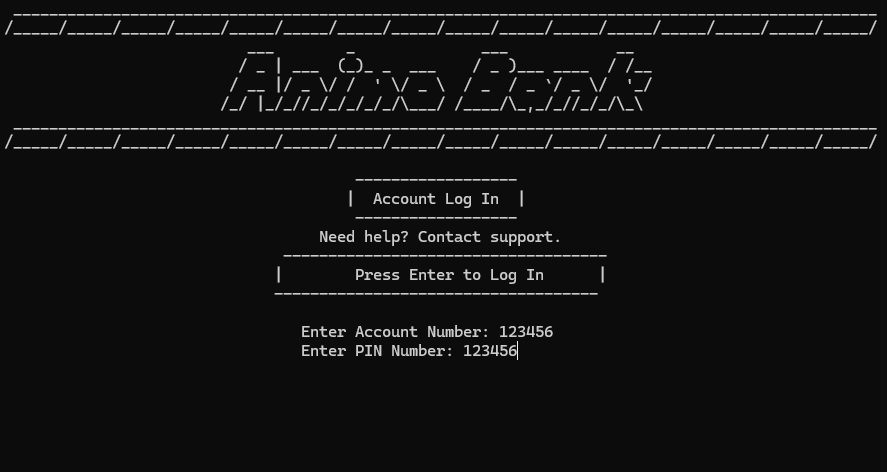

# ATM System Simulator - A Command-Line Banking Project (Educational Use)

## 🧠 About the Project

This **ATM System Simulator** is a console-based banking application developed in C. It mimics real-world ATM operations and allows users to manage financial transactions through a secure and interactive interface.

The core functionality includes:

* **User Authentication:** Secure login using account number and PIN with up to 3 attempts.
* **PIN Management:** Users can change their PIN after successful login and identity verification.
* **Balance Inquiry:** Check and display the user's current account balance.
* **Deposits and Withdrawals:** Cash management with denomination selection and P100-interval restrictions.
* **Funds Transfer:** Send money to other valid account numbers (excluding the user’s own).
* **Bill Payment:** Simulate paying bills to predefined billers.
* **Transaction History:** Displays the 5 most recent transactions logged in an external file.
* **Visual Interface:** Menu-driven with ASCII banners and loading animations for a more dynamic user experience.

## 🎯 Purpose

This project was built as a practical application of C programming concepts, focusing on:

* **Modular Programming:** Utilizing header files and function abstraction.
* **Pointers and Memory Access:** Safely modifying balance and PIN via pointer arguments.
* **File I/O in C:** Writing and reading transaction logs using standard I/O functions.
* **Input Validation:** Ensuring correctness and robustness in all user-driven data.
* **Menu-Based Flow Control:** Designing a simple yet effective CLI-based banking interface.
* **Simulating Financial Systems:** Emulating basic banking features while maintaining data integrity.

## 👾 Login Page Screenshot  


## 👾 Menu Screenshot  

## 📌 Disclaimer

This project was created solely for **educational purposes and academic submission**. It does not connect to a real database or banking service and is meant only to simulate ATM functionality on a local terminal.

The system is entirely offline and designed to reinforce foundational programming skills through the simulation of practical banking tasks.

## 🔒 License – Strict Educational Use Only

This project is protected under a **Strict Educational Use Only** license. This means you are allowed to view this code for personal learning or reference only. The following restrictions apply:

🚫 **Absolutely NOT Allowed:**

❌ No Copy-Paste or Direct Use of any part of the code for your own academic submissions or projects.  
❌ No Redistribution of this code, modified or unmodified, in public or private repositories.  
❌ No Commercial Use — you may not monetize or sell this project in any form.  
❌ No Sub-licensing or use in derivative works intended for reuse or public release.

✅ **Permitted:**

✅ You may study this project to learn ATM system design or C programming techniques.  
✅ You may build your own version inspired by it, but you must write all code independently.  
✅ You must credit the original author if referencing or discussing the project publicly.

```c
// Copyright (c) 2025 Edriene James A. Paingan
// This code is licensed under a Non-Commercial, Attribution Required license.
// See the LICENSE file for details.
